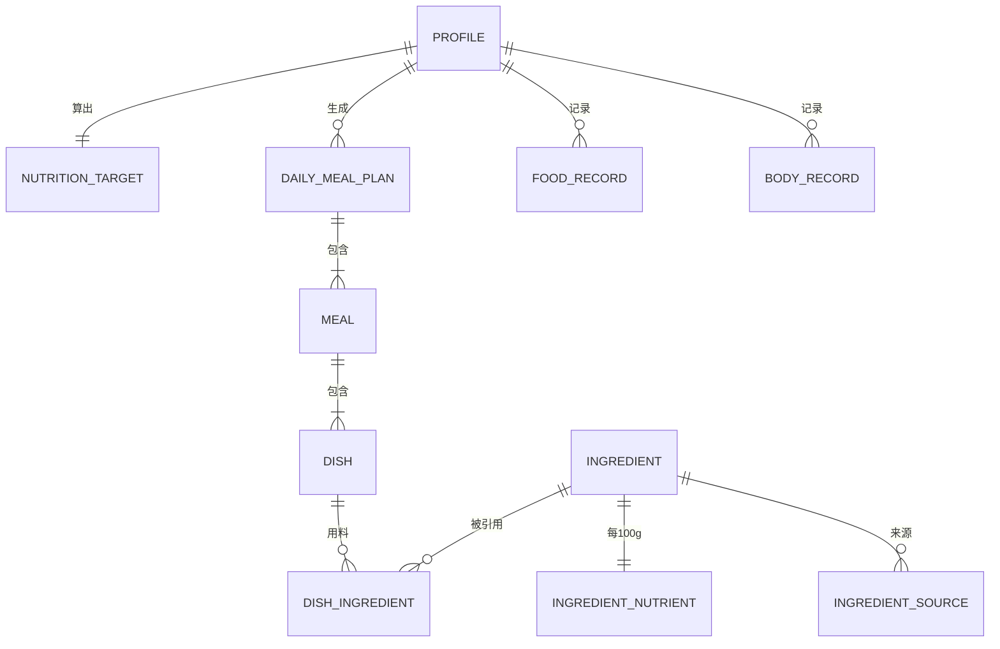

# 健康食谱 · 数据表设计

> 版本：v0.1 ｜ 阶段：3/8 ｜ 依赖：`PRD.md`、`页面清单与流程图.md`
> 数据库：本地 SQLite（通过 **Drift** 访问）｜ 单用户，无后端
> 约定：主键 `id` 用自增整数；时间统一存 `INTEGER`（Unix 毫秒）；布尔存 `INTEGER(0/1)`；数组/复杂结构存 `TEXT`（JSON 字符串）。

---

## 一、表总览

| 表名 | 中文 | 作用 | 行数规模 |
|---|---|---|---|
| `profile` | 个人档案 | **唯一数据源**，只存 1 行 | 1 |
| `nutrition_target` | 营养目标 | 由档案算出的目标，存最新 1 行 | 1 |
| `daily_meal_plan` | 每日食谱 | 每天 1 行 | 30/月 |
| `meal` | 餐 | 每天 3 行（早/午/晚） | 90/月 |
| `dish` | 菜品 | 每餐多行 | 数百/月 |
| `dish_ingredient` | 菜品-食材 | 关联表 | 数千/月 |
| `ingredient` | 食材主表 | 食材字典（缓存） | 数百 |
| `ingredient_nutrient` | 食材营养素 | 每 100g 数据 | 与食材 1:1 |
| `ingredient_source` | 食材来源 | 来源链接+检索日期 | 每食材多条 |
| `food_record` | 饮食记录 | 用户手记账 | 用户决定 |
| `body_record` | 体重/体脂记录 | 用户手记账 | 用户决定 |
| `search_history` | 搜索历史 | 搜索页记录 | 自动 |
| `app_setting` | 应用设置 | 键值表（API Key、主题等） | 少量 |

---

## 二、实体关系图

**文字版**：档案 1 条 → 算出 1 组营养目标；档案 → 每天生成 1 份食谱 → 3 餐 → 多道菜 → 多种食材；食材 → 营养素 + 多个来源；档案 → 饮食记录 / 体重记录。

---

## 三、表结构明细

### 3.1 `profile` 个人档案（唯一数据源，固定 1 行）

| 字段 | 类型 | 说明 | 约束/默认 |
|---|---|---|---|
| `id` | INTEGER | 主键 | PK，恒为 1 |
| `age` | INTEGER | 年龄 | 1–120，默认 30 |
| `gender` | TEXT | 性别 `male`/`female` | 默认 `male` |
| `height_cm` | REAL | 身高 cm | 80–250，默认 175 |
| `weight_kg` | REAL | 体重 kg | 20–300，默认 70 |
| `body_fat_percent` | REAL? | 体脂率 %（可选） | 可空 |
| `target_weight_kg` | REAL? | 目标体重（可选） | 可空 |
| `goal` | TEXT | 目标 `lose`/`gain`/`maintain` | 默认 `maintain` |
| `activity_level` | TEXT | `sedentary`/`light`/`moderate`/`active`/`very_active` | 默认 `light` |
| `diet_preference` | TEXT | 饮食偏好（如「中餐」） | 默认 `中餐` |
| `allergies` | TEXT | 过敏忌口，JSON 数组字符串 | 默认 `[]` |
| `medical_notes` | TEXT? | 疾病用药（可选） | 可空 |
| `is_complete` | INTEGER | 是否完整填过 | 默认 0 |
| `created_at` | INTEGER | 创建时间 | 自动 |
| `updated_at` | INTEGER | 更新时间 | 自动 |

> 说明：BMI/BMR/TDEE 等**派生值不放这里**，放 `nutrition_target`，避免档案里混入计算结果。

### 3.2 `nutrition_target` 营养目标（最新 1 行）

| 字段 | 类型 | 说明 |
|---|---|---|
| `id` | INTEGER | 主键 |
| `profile_id` | INTEGER | 外键 → `profile.id` |
| `bmi` | REAL | 体质指数（本地公式） |
| `bmr` | REAL | 基础代谢率（本地公式） |
| `tdee` | REAL | 总消耗（本地公式） |
| `target_calories` | REAL | 每日目标热量 |
| `protein_g` | REAL | 蛋白质目标克数 |
| `carbs_g` | REAL | 碳水目标克数 |
| `fat_g` | REAL | 脂肪目标克数 |
| `breakfast_cal` | REAL | 早餐分配热量（约 30%） |
| `lunch_cal` | REAL | 午餐分配热量（约 40%） |
| `dinner_cal` | REAL | 晚餐分配热量（约 30%） |
| `formula_version` | TEXT | 计算公式版本（便于日后修正） |
| `calculated_at` | INTEGER | 计算时间 |

### 3.3 `daily_meal_plan` 每日食谱

| 字段 | 类型 | 说明 |
|---|---|---|
| `id` | INTEGER | 主键 |
| `plan_date` | TEXT | 日期 `YYYY-MM-DD`（**唯一**） |
| `goal` | TEXT | 生成时的目标快照 |
| `target_calories` | REAL | 当日目标热量快照 |
| `total_calories` | REAL | 三餐合计热量 |
| `total_protein_g` | REAL | 合计蛋白 |
| `total_carbs_g` | REAL | 合计碳水 |
| `total_fat_g` | REAL | 合计脂肪 |
| `status` | TEXT | `generating`/`ready`/`failed` |
| `generated_at` | INTEGER | 生成时间 |
| `source_note` | TEXT | 数据来源摘要（用了哪些 API） |

### 3.4 `meal` 餐（早/午/晚）

| 字段 | 类型 | 说明 |
|---|---|---|
| `id` | INTEGER | 主键 |
| `plan_id` | INTEGER | 外键 → `daily_meal_plan.id` |
| `meal_type` | TEXT | `breakfast`/`lunch`/`dinner` |
| `sort_order` | INTEGER | 0/1/2（早/午/晚固定顺序） |
| `calories` | REAL | 该餐总热量 |
| `protein_g` | REAL | 蛋白 |
| `carbs_g` | REAL | 碳水 |
| `fat_g` | REAL | 脂肪 |
| `cover_image_url` | TEXT? | 缩略图 URL |

### 3.5 `dish` 菜品

| 字段 | 类型 | 说明 |
|---|---|---|
| `id` | INTEGER | 主键 |
| `meal_id` | INTEGER | 外键 → `meal.id` |
| `name` | TEXT | 菜名 |
| `image_url` | TEXT? | 图片 URL |
| `calories` | REAL | 热量 |
| `protein_g` | REAL | 蛋白 |
| `carbs_g` | REAL | 碳水 |
| `fat_g` | REAL | 脂肪 |
| `steps` | TEXT | 做法步骤（JSON 数组字符串） |
| `source_url` | TEXT? | 来源链接 |
| `retrieved_date` | TEXT? | 检索日期 |

### 3.6 `dish_ingredient` 菜品-食材关联

| 字段 | 类型 | 说明 |
|---|---|---|
| `id` | INTEGER | 主键 |
| `dish_id` | INTEGER | 外键 → `dish.id` |
| `ingredient_id` | INTEGER? | 外键 → `ingredient.id`（可能未缓存） |
| `ingredient_name` | TEXT | 食材名（快照，防止食材缺失） |
| `amount` | REAL? | 用量 |
| `unit` | TEXT? | 单位（g/ml/个…） |

### 3.7 `ingredient` 食材主表（缓存）

| 字段 | 类型 | 说明 |
|---|---|---|
| `id` | INTEGER | 主键 |
| `name` | TEXT | 食材名（唯一） |
| `name_en` | TEXT? | 英文名 |
| `image_url` | TEXT? | 图片 URL |
| `evidence_level` | TEXT | `strong`/`medium`/`weak`/`folk`/`insufficient`（强/中/弱/民间/证据不足） |
| `benefits` | TEXT | 营养优势 3–5 条（JSON） |
| `pairings` | TEXT | 推荐搭配（JSON） |
| `cautions_evidence` | TEXT | 注意搭配·有科学证据（JSON） |
| `cautions_folk` | TEXT | 注意搭配·证据不足/民间说法（JSON） |
| `possible_effects` | TEXT | 可能后果（只含有来源内容，JSON） |
| `drug_interactions` | TEXT | 药物交互（JSON，已联网查证） |
| `disclaimer` | TEXT | 免责声明文本 |
| `fetched_at` | INTEGER | 抓取时间 |
| `expire_at` | INTEGER | 过期时间（缓存失效） |

### 3.8 `ingredient_nutrient` 食材营养素（每 100g）

| 字段 | 类型 | 说明 |
|---|---|---|
| `id` | INTEGER | 主键 |
| `ingredient_id` | INTEGER | 外键 → `ingredient.id`（唯一） |
| `calories_kcal` | REAL? | 热量 |
| `protein_g` | REAL? | 蛋白质 |
| `carbs_g` | REAL? | 碳水 |
| `fat_g` | REAL? | 脂肪 |
| `fiber_g` | REAL? | 纤维 |
| `sodium_mg` | REAL? | 钠 |
| `calcium_mg` | REAL? | 钙 |
| `iron_mg` | REAL? | 铁 |
| `vitamins_json` | TEXT? | 维生素等（JSON，键值对） |
| `per` | INTEGER | 基准克数，默认 100 |

### 3.9 `ingredient_source` 食材来源

| 字段 | 类型 | 说明 |
|---|---|---|
| `id` | INTEGER | 主键 |
| `ingredient_id` | INTEGER | 外键 → `ingredient.id` |
| `title` | TEXT | 来源标题 |
| `url` | TEXT | 链接 |
| `publisher` | TEXT? | 发布机构（WHO/USDA/NIH…） |
| `retrieved_date` | TEXT | 检索日期 `YYYY-MM-DD` |
| `evidence_level` | TEXT | 该条来源的证据等级 |

### 3.10 `food_record` 饮食记录

| 字段 | 类型 | 说明 |
|---|---|---|
| `id` | INTEGER | 主键 |
| `profile_id` | INTEGER | 外键 → `profile.id` |
| `record_date` | TEXT | 日期 |
| `meal_type` | TEXT | 早/午/晚/加餐 |
| `food_name` | TEXT | 食物名 |
| `amount_g` | REAL? | 份量克数 |
| `calories` | REAL | 热量 |
| `protein_g` | REAL | 蛋白 |
| `carbs_g` | REAL | 碳水 |
| `fat_g` | REAL | 脂肪 |
| `note` | TEXT? | 备注 |
| `created_at` | INTEGER | 创建时间 |

### 3.11 `body_record` 体重/体脂记录

| 字段 | 类型 | 说明 |
|---|---|---|
| `id` | INTEGER | 主键 |
| `profile_id` | INTEGER | 外键 → `profile.id` |
| `record_date` | TEXT | 日期（唯一） |
| `weight_kg` | REAL | 体重 |
| `body_fat_percent` | REAL? | 体脂率 |
| `note` | TEXT? | 备注 |
| `created_at` | INTEGER | 创建时间 |

### 3.12 `search_history` 搜索历史

| 字段 | 类型 | 说明 |
|---|---|---|
| `id` | INTEGER | 主键 |
| `query` | TEXT | 搜索词 |
| `query_type` | TEXT | `ingredient`/`dish` |
| `created_at` | INTEGER | 时间 |

### 3.13 `app_setting` 应用设置（键值）

| 字段 | 类型 | 说明 |
|---|---|---|
| `key` | TEXT | 主键，设置名 |
| `value` | TEXT | 值（字符串，复杂值用 JSON） |

预置键：

| key | 含义 | 默认 |
|---|---|---|
| `deepseek_api_key` | DeepSeek 密钥 | 空 |
| `search_api_provider` | `brave`/`tavily` | `brave` |
| `search_api_key` | 搜索密钥 | 空 |
| `recipe_api_provider` | `spoonacular`/`edamam` | `spoonacular` |
| `recipe_api_key` | 食谱密钥 | 空 |
| `theme_mode` | `system`/`light`/`dark` | `system` |
| `last_meal_plan_date` | 最近生成食谱日期 | 空 |

---

## 四、本地计算公式（不外传，不靠 AI）

| 指标 | 公式 | 备注 |
|---|---|---|
| BMI | 体重kg ÷ (身高m)² | 直接计算 |
| BMR（男） | 10×体重 + 6.25×身高cm − 5×年龄 + 5 | Mifflin-St Jeor |
| BMR（女） | 10×体重 + 6.25×身高cm − 5×年龄 − 161 | Mifflin-St Jeor |
| TDEE | BMR × 活动系数 | 见下表 |
| 目标热量 | TDEE × 目标系数 | 减脂 0.8 / 增肌 1.1 / 维持 1.0 |
| 蛋白/碳水/脂肪 | 按比例或每 kg 体重 | 版本号写入 `formula_version` |

活动系数：久坐 1.2 / 轻度 1.375 / 中度 1.55 / 活跃 1.725 / 非常活跃 1.9。

> 示例默认值结果（30/男/175/70/维持/轻度）会在阶段 4 代码里给出并可用于自测。

---

## 五、缓存与失效策略

| 数据 | 新鲜判定 | 过期后行为 |
|---|---|---|
| 今日食谱 `daily_meal_plan` | `plan_date == 今天` | 重新联网生成，旧的保留供历史查看 |
| 食材 `ingredient` | `now < expire_at` | 后台重新检索，期间先显示旧数据 |
| 搜索/食谱网络结果 | 同一次会话内 | 不长期缓存 |

> 默认 `ingredient.expire_at` = 抓取时间 + 30 天（营养数据变化慢，减少 API 花费）。
> 档案保存后：删除/标记今日 `daily_meal_plan` 失效 → 强制重新生成。

---

## 六、索引

- `daily_meal_plan.plan_date` 唯一索引。
- `meal.plan_id`、`dish.meal_id`、`dish_ingredient.dish_id`、`dish_ingredient.ingredient_id` 普通索引。
- `ingredient.name` 唯一索引。
- `ingredient_source.ingredient_id`、`food_record.record_date`、`body_record.record_date` 普通索引。

---

## 七、迁移策略

- 用 Drift 的 `schemaVersion` + `MigrationStrategy`。
- 首版 `schemaVersion = 1`。
- 后续加字段用 `onUpgrade` 的 `m.addColumn(...)`，不删旧数据。

---

## 八、下一步

确认数据表设计后，进入 **阶段 4：完整 Flutter 代码**（`pubspec.yaml`、`lib/` 全部代码、Drift 表定义、Riverpod 状态、联网服务、页面实现，保证可编译运行）。
