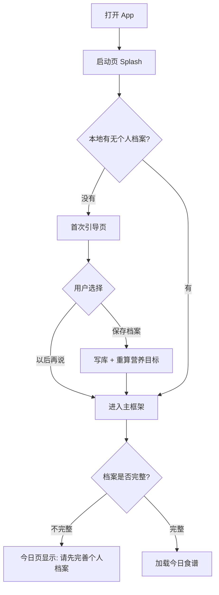
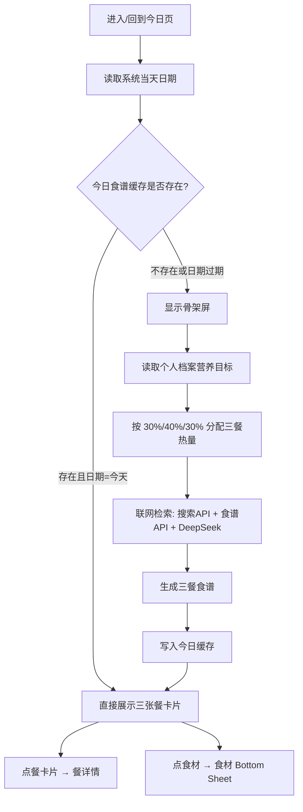
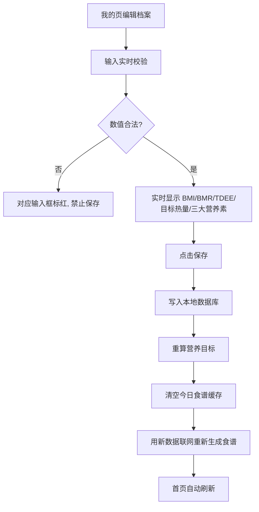
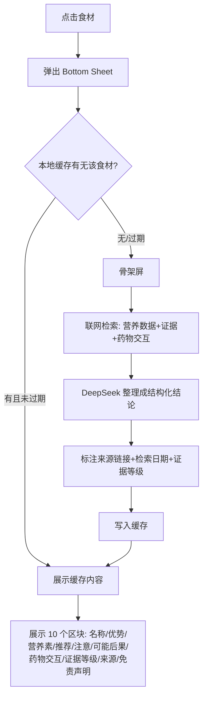

# 健康食谱 · 页面清单与流程图

> 版本：v0.1 ｜ 阶段：2/8 ｜ 依赖：`docs/PRD.md`
> 说明：Mermaid 图在 GitHub / 支持 Markdown 的编辑器里会自动渲染成图形；不会渲染时请看每张图下方的「文字版」。

---

## 一、页面清单（共 9 个页面 + 1 个全局弹窗）

| # | 页面名 | 建议文件 | 从哪里进入 | 主要内容 | 关键组件 |
|---|---|---|---|---|---|
| 0 | 启动页 Splash | `splash_page.dart` | App 启动 | 读档案判断去向 | 居中 Logo、加载指示 |
| 1 | 首次引导 · 档案填写 | `onboarding_page.dart` | 启动页（档案为空时） | 引导填档案，可「以后再说」 | 表单、实时校验、指标卡片 |
| 2 | 主框架（底部导航） | `main_shell.dart` | 启动页 | 承载 4 个 Tab | `NavigationBar`（M3） |
| 3 | 今日食谱（Tab1） | `home_page.dart` | 主框架 | 早/午/晚三卡片、骨架屏、空档案提示 | 卡片(圆角16)、骨架屏、缩略图 |
| 4 | 餐详情页 | `meal_detail_page.dart` | 点首页卡片 | 食材清单、每道菜做法、营养数据、来源链接 | 列表、可点击食材项、外链 |
| 5 | 搜索页（Tab2） | `search_page.dart` | 主框架 | 搜食材/菜品，结果列表 | 搜索框、结果卡片 |
| 6 | 记录页（Tab3） | `record_page.dart` | 主框架 | 饮食热量记录、体重记录、简单图表 | 列表、图表、日期选择 |
| 7 | 我的 · 个人档案（Tab4） | `profile_page.dart` | 主框架 | 全部档案字段、实时指标、保存 | 表单、校验、指标卡片 |
| 8 | 设置页 | `settings_page.dart` | 我的页右上角 | API Key、深色模式、清缓存、关于/免责声明 | 开关、列表、弹窗 |
| 9 | 关于/免责声明页 | `about_page.dart` | 设置页 | 数据来源、开源许可、免责声明 | 富文本、链接 |
| 弹窗 | 食材详情 Bottom Sheet（全局） | `ingredient_sheet.dart` | 任意食材点击 | PRD 第 4.2 节全部 10 项 | `showModalBottomSheet`、分区块、证据等级标签 |

> 说明：食材弹窗不占独立页面，而是全局可调用的 Bottom Sheet，从今日、餐详情、搜索三处都能弹出。

---

## 二、整体导航结构（文字版树状图）

```
启动页 Splash
├── 档案为空 ──► 首次引导 · 档案填写
│                    ├── 保存 ──► 主框架
│                    └── 以后再说 ──► 主框架
└── 档案已存在 ──► 主框架

主框架（底部导航）
├── Tab1 今日食谱
│      └── 点餐卡片 ──► 餐详情页
│                            └── 点食材 ──► 食材详情 Bottom Sheet
│      └── 点卡片内食材 ──► 食材详情 Bottom Sheet
├── Tab2 搜索
│      └── 点结果/食材 ──► 食材详情 Bottom Sheet
├── Tab3 记录
│      └── 添加记录 / 体重记录
└── Tab4 我的（个人档案）
       └── 右上角 ──► 设置页
                        └── 关于/免责声明页
```

---

## 三、流程图

### 3.1 首次启动 / 启动流程



**文字版**：打开 App → 启动页判断档案 → 没档案走引导页（可跳过）→ 进主框架 → 档案不完整则今日页给提示，完整则加载食谱。

### 3.2 今日食谱自动刷新流程（核心）



**文字版**：读当天日期 → 查缓存 → 有就直接显示，没有就骨架屏 + 联网生成 → 存缓存 → 显示。

### 3.3 个人档案保存流程



### 3.4 食材查询流程（点击任意食材）



---

## 四、底部导航定义

| 位置 | 名称 | 图标(建议) | 说明 |
|---|---|---|---|
| 1 | 今日 | `Icons.today` / restaurant | 默认首页，三餐卡片 |
| 2 | 搜索 | `Icons.search` | 搜食材、菜品 |
| 3 | 记录 | `Icons.edit_note` | 饮食/体重记录 |
| 4 | 我的 | `Icons.person` | 个人档案 + 设置入口 |

---

## 五、页面状态约定（每个联网页面都要有）

| 状态 | 表现 |
|---|---|
| 加载中 | 骨架屏（不打转圈遮挡整屏） |
| 成功 | 正常内容 |
| 空数据 | 友好空状态 + 引导按钮（如「去完善档案」） |
| 出错 | 错误提示 + 「重试」按钮，保留上一次缓存内容 |
| 离线 | 展示缓存 + 顶部提示「当前离线，显示上次结果」 |

---

## 六、下一步

确认本页面清单与流程图后，进入 **阶段 3：数据表设计**（本地数据库表结构、字段、类型、关系与缓存策略）。
